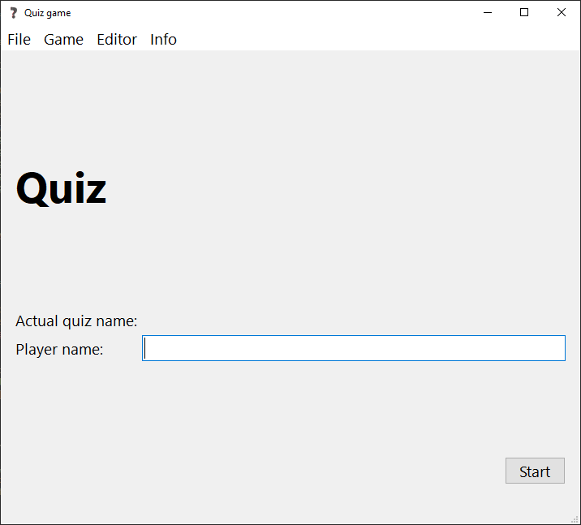
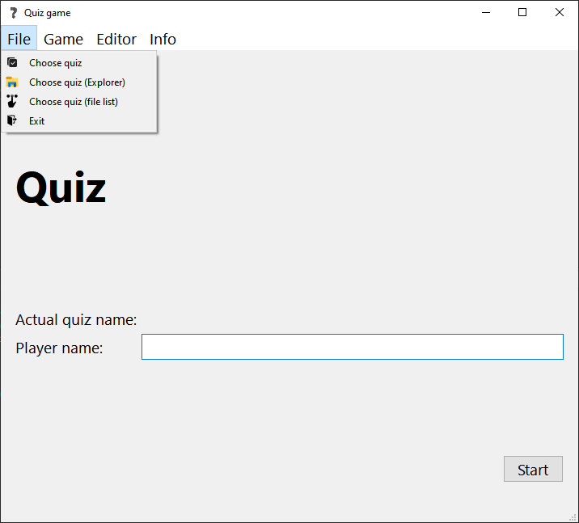
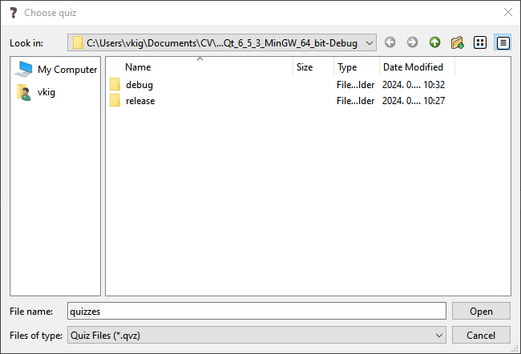
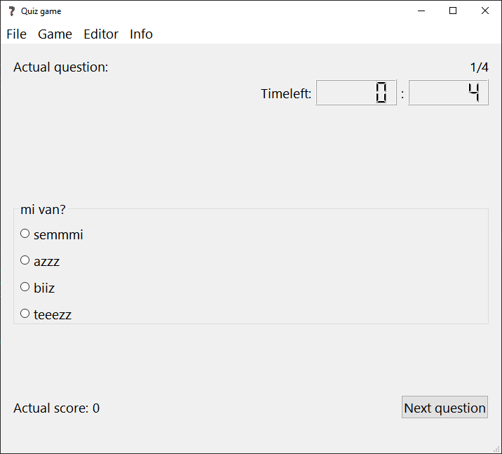
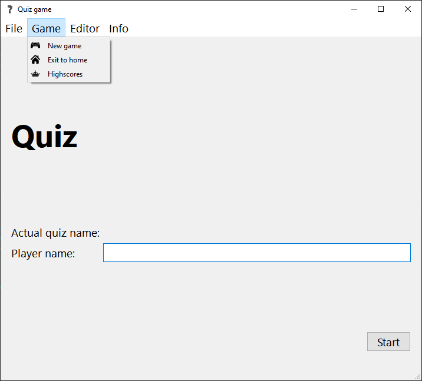
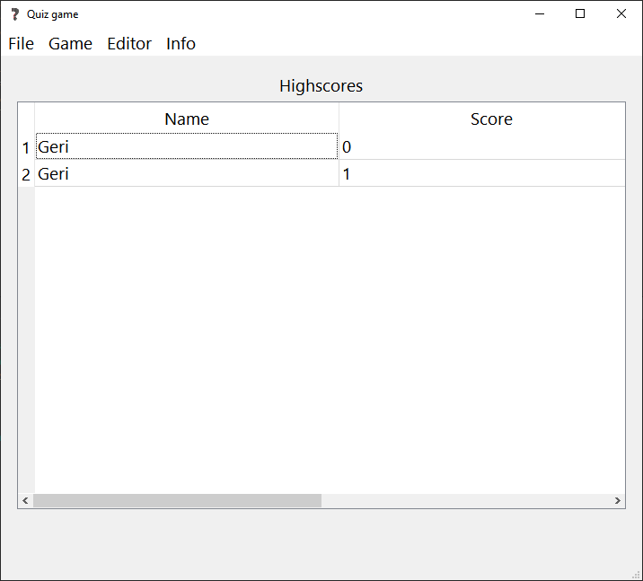
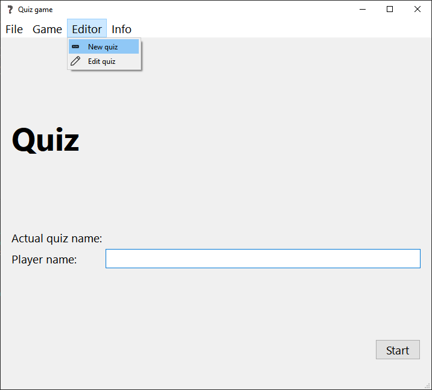
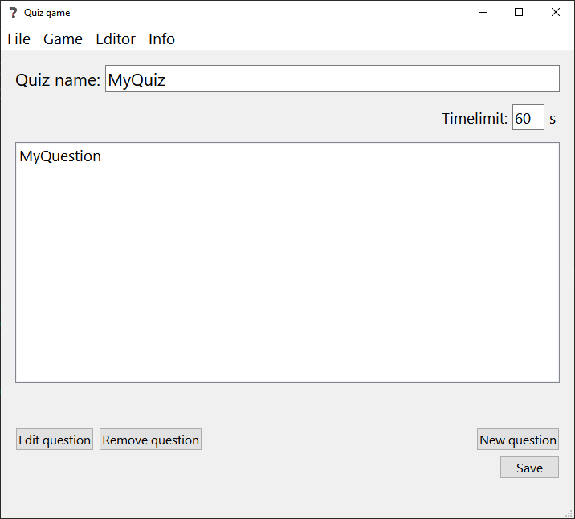
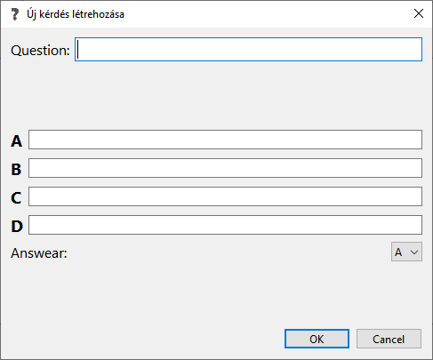
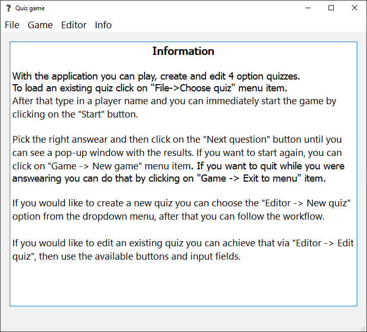

# Quiz Game
This project is written in C++ language with the help of Qt framework. Tested with Qt 6.5.3 and MinGW 64. The game has an Information page where you can find some instructions what can be done.

# Pictures and examples
- You can set your player name on the main page:

- You should choose a quiz to play, which can be accessed under *File* menu item:

- There are three options to choose the quiz file (with Qt file picker, with default file explorer and via the application):

- After selecting a quiz you can click on the *Start* button and you will see the following screen:

- You can click on *Game* menu item to go back to the main page or see the highscores on the loaded quiz:

- The highscores are showed as follows:

- You can also create/edit your own quiz, access these functionalities via *Editor* menu item:

- You can edit your own quiz, add new question, remove question, set timelimit, rename quiz or edit question:

- If you click on edit question you will see a pop-up window with the following options:

- You can also visit the info page of the application to check how it works:

